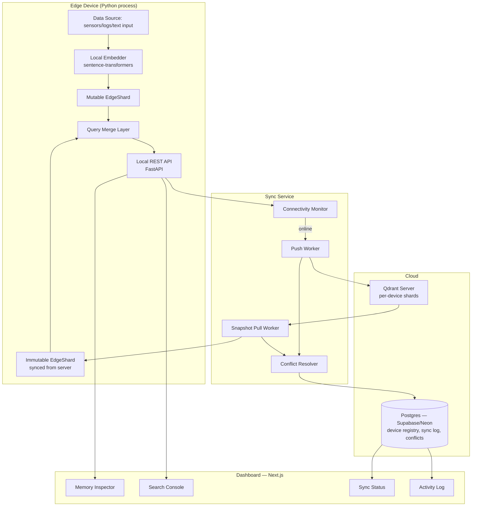
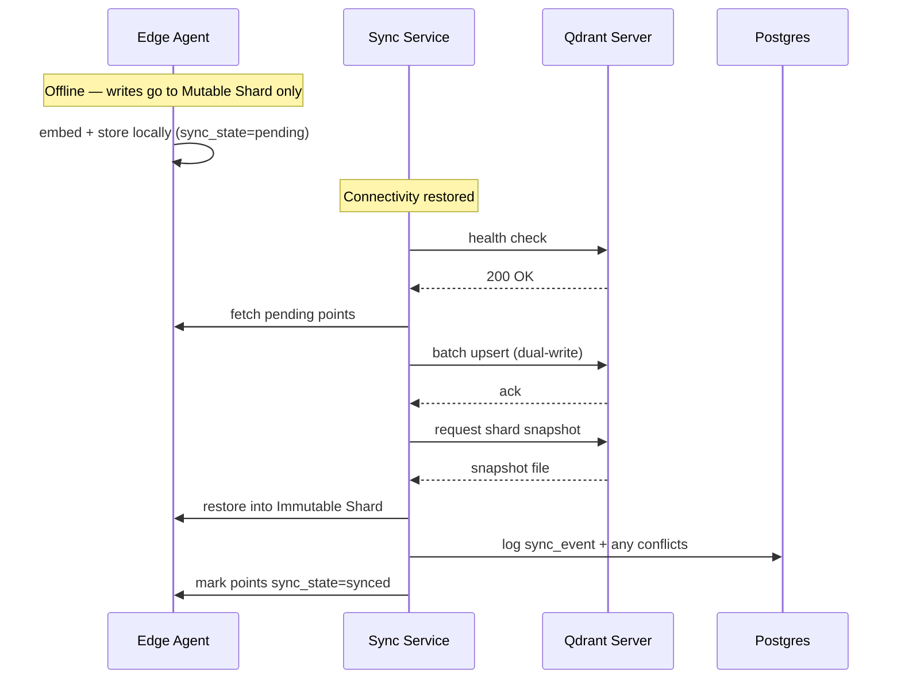

# AI-Powered Edge Memory & Intelligence Platform
### System Design Document — Qdrant Edge Hackathon (Problem Statement 03)

---

## 1. Problem Summary

Build an offline-first AI application using **Qdrant Edge** that maintains searchable semantic memory directly on a device, performs low-latency vector/hybrid search with zero network dependency, and intelligently synchronizes local memory with a central **Qdrant Server** when connectivity returns.

**Explicitly required:**
- Local vector storage + retrieval on-device
- Local vs. cloud data placement policy
- Bidirectional sync with conflict handling
- Offline operation that's demonstrably real (not simulated)
- A UI showing device memory, search, sync status, and activity

---

## 2. Core Concept: Qdrant Edge

Qdrant Edge is a lightweight version of Qdrant built for edge devices and resource-constrained environments. Unlike Qdrant Server's client-server model, **Qdrant Edge runs in-process** — no daemon, no network hop. It exposes an `EdgeShard` object (Python/Rust) for managing, querying, and snapshotting data locally.

**The sync trick that makes this "real":** run two shards per device.
- **Mutable Shard** — handles local writes (new data created on-device)
- **Immutable Shard** — mirrors a shard from the server collection via snapshot restore

Search queries **merge results from both shards**, so freshly-created local data is searchable immediately alongside synced cloud knowledge — this is what separates "a real edge-cloud system" from "a local vector DB demo."

---

## 3. High-Level Architecture



---

## 4. Component Breakdown

### 4.1 Edge Agent (Python)
Runs entirely in-process on the "device." Responsibilities:
- Ingest raw data → embed locally (no API calls) using `sentence-transformers` (`all-MiniLM-L6-v2`, ~80MB, CPU-friendly)
- Write points to the **mutable EdgeShard**
- Serve local search over both shards via a thin FastAPI wrapper
- Tag every point with `origin: local | synced`, `created_at`, `sync_state`

**Kill/restart this process to simulate offline mode** — the dashboard should visibly stop receiving sync heartbeats when it's down. This is your live offline proof for judges.

### 4.2 Sync Service
A separate always-on service (can run alongside the edge agent or as its own container):

| Function | Behavior |
|---|---|
| Connectivity Monitor | Polls server reachability every N seconds; flips device state `online`/`offline` |
| Push Worker | On reconnect, batches all `sync_state: pending` points from the mutable shard and dual-writes them to the server collection |
| Snapshot Pull Worker | Requests `{QDRANT_URL}/collections/{COLLECTION}/shards/{shard_id}/snapshot`, downloads it, restores into the immutable shard |
| Conflict Resolver | Compares timestamps on overlapping point IDs; applies policy (see §6); logs conflicts to Postgres |

### 4.3 Qdrant Server (Cloud)
- Docker (`qdrant/qdrant`) on your existing Linux cloud server, or Qdrant Cloud free tier
- One collection, **sharded per device** — lets many edge devices sync independently against the same collection without collisions
- Holds the canonical/aggregated memory

### 4.4 Metadata Store (Postgres — Supabase/Neon)
Not vector data — just operational state:
- `devices` (id, name, last_seen, status)
- `sync_events` (device_id, timestamp, points_pushed, points_pulled, duration)
- `conflicts` (point_id, device_id, local_value, server_value, resolution, resolved_at)

### 4.5 Dashboard (Next.js)
Four panels, matching the PS requirement directly:
1. **Memory Inspector** — browse local points, filter by `origin`
2. **Search Console** — run a query, see it hit both shards, show latency
3. **Sync Status** — online/offline indicator, last sync time, pending point count
4. **Activity Log** — real-time feed of embed/search/sync/conflict events

---

## 5. Data Model

### 5.1 Qdrant Point Schema
```json
{
  "id": "uuid",
  "vector": [0.021, -0.114, ...],
  "payload": {
    "content": "raw text or data summary",
    "device_id": "edge-device-01",
    "origin": "local | synced",
    "sync_state": "pending | synced | conflict",
    "created_at": "2026-09-27T10:15:00Z",
    "updated_at": "2026-09-27T10:15:00Z",
    "category": "sensor | log | note | ..."
  }
}
```

### 5.2 Postgres Schema (simplified)
```sql
CREATE TABLE devices (
  id UUID PRIMARY KEY,
  name TEXT,
  last_seen TIMESTAMPTZ,
  status TEXT CHECK (status IN ('online','offline'))
);

CREATE TABLE sync_events (
  id UUID PRIMARY KEY,
  device_id UUID REFERENCES devices(id),
  started_at TIMESTAMPTZ,
  points_pushed INT,
  points_pulled INT,
  status TEXT
);

CREATE TABLE conflicts (
  id UUID PRIMARY KEY,
  point_id UUID,
  device_id UUID REFERENCES devices(id),
  local_updated_at TIMESTAMPTZ,
  server_updated_at TIMESTAMPTZ,
  resolution TEXT,
  resolved_at TIMESTAMPTZ
);
```

---

## 6. Local vs. Cloud Data Policy

A simple, defensible rule set (state this explicitly to judges — the PS calls out "dynamically decide" as a required capability):

| Data type | Stays local | Syncs to cloud |
|---|---|---|
| Raw high-frequency data (sensor readings, logs) | ✅ always | ❌ never (volume/privacy) |
| Derived summaries / embeddings of raw data | — | ✅ synced |
| User-generated notes/queries | ✅ immediately searchable | ✅ after debounce (e.g. 30s) |
| Anything flagged sensitive (`category: private`) | ✅ always | ❌ never |

Implement this as a simple rule evaluated at write-time in the Edge Agent, not an afterthought — this is the "dynamic decision" the PS asks for.

---

## 7. Sync Sequence



**Conflict rule (hackathon-simple):** if a point ID exists in both shards with different `updated_at`, the more recent timestamp wins; the losing version is logged to `conflicts` and surfaced in the Activity Log rather than silently discarded — this gives you something concrete to show on screen.

---

## 8. Tech Stack

| Layer | Choice | Rationale |
|---|---|---|
| Edge agent | Python + `qdrant-edge` + `sentence-transformers` | Only language with Qdrant Edge bindings |
| Local API | FastAPI | Thin wrapper, fast to stand up |
| Sync service | Python (shares process/libs with edge agent) | Avoids cross-language shard access |
| Cloud vector DB | Qdrant Server (Docker) or Qdrant Cloud free tier | Self-host on your existing Linux server, or zero-setup Cloud |
| Metadata DB | Supabase/Neon (Postgres) + Prisma | Matches your existing pattern |
| Dashboard | Next.js | Your strongest area |
| Deploy (server side) | Google Cloud Run | You already use it |
| Device simulation | Run edge agent as its own process/container; kill it to fake "offline" | Simple, visibly demoable |

---

## 9. Build Plan (Hackathon Timeline)

| Phase | Time | Deliverable |
|---|---|---|
| 1 | Hrs 0–3 | Edge Agent: embed + store + query, single mutable shard, works fully offline |
| 2 | Hrs 3–6 | Qdrant Server up (Docker), manual push script working |
| 3 | Hrs 6–10 | Sync Service: connectivity monitor + push/pull + immutable shard restore |
| 4 | Hrs 10–13 | Conflict logging + local/cloud policy rule implemented |
| 5 | Hrs 13–18 | Dashboard: 4 panels wired to real data |
| 6 | Hrs 18–20 | Kill/restart offline demo rehearsed; polish + activity log realism |
| 7 | Hrs 20–24 | Buffer, bug fixes, demo script |

---

## 10. Demo Script (for judges)

1. Show dashboard: device online, memory empty
2. Add a few data points → embed + search locally, instant
3. **Kill the edge agent's network** (not the process) — show search still works, new data still writable
4. Add more local-only data while "offline"
5. Restore connectivity → watch Sync Status flip, Activity Log shows push/pull happening live
6. Show a conflict example resolved and logged
7. Point out the local-vs-cloud policy in action (one raw data point stayed local, its summary synced)

---

## 11. Risks & Mitigations

| Risk | Mitigation |
|---|---|
| Qdrant Edge Python bindings are new/less documented | Budget extra time in Phase 1; keep a REST-based Qdrant Server fallback path in case Edge bindings block you |
| Embedding model too slow on "edge" simulation | Use MiniLM (small, CPU-fast); pre-warm the model at startup |
| Conflict demo feels contrived | Script a specific scenario (edit same note locally and on another simulated device) rather than relying on random conflicts |
| Judges ask "why not just cache?" | Emphasize the dual-shard merge query and the local/cloud policy — that's the differentiator over a simple cache |
